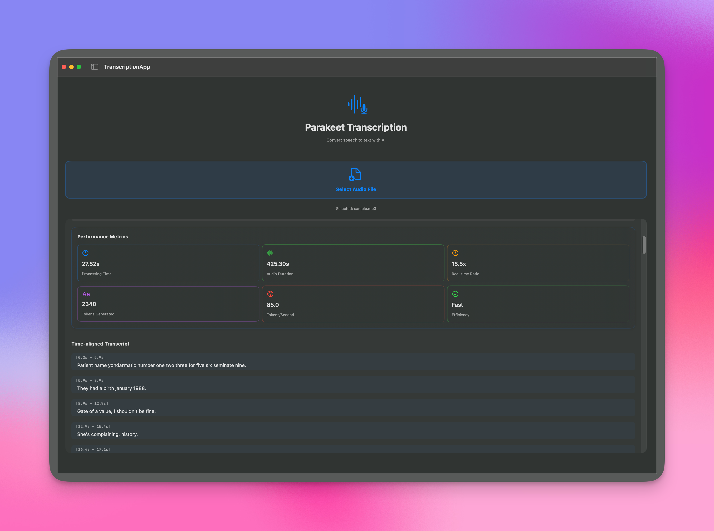

# ParakeetMLX Swift

[](https://swift.org)
[](https://developer.apple.com)
[](LICENSE)
[](https://github.com/ml-explore/mlx-swift)

A Swift implementation of the Parakeet speech recognition models using MLX Swift. This library provides high-performance speech-to-text transcription capabilities for **macOS and iOS applications**. 

> **🎯 Perfect for**: iOS apps, macOS apps, real-time transcription, audio processing pipelines, and accessibility features.

The code was translated from [senstella/parakeet-mlx](https://github.com/senstella/parakeet-mlx) - all credits go to the original creator. We are merely translating it to Swift so that we can use it to build iOS/macOS apps!

**Note**: We have focused on the TDT (Token-Duration-Transducer) variant of the Parakeet model. We have only tested `mlx-community/parakeet-tdt-0.6b-v2`. If you want to use other variants, PRs are welcome! We also need to properly implement caching here as well. 



## Requirements

- **macOS 14.0+ or iOS 16.0+**
- **Apple Silicon (M1/M2/M3/M4)** - Intel devices not tested
- **Xcode 15.0+**
- **Swift 6.1+**

### Memory Requirements

- **Model**: ~2.5GB (for mlx-community/parakeet-tdt-0.6b-v2)
- **Audio processing**: ~100MB per minute of audio
- **Recommended**: 8GB+ RAM for comfortable usage

## Installation

### Swift Package Manager

Add the following to your `Package.swift` file:

```swift
dependencies: [
    .package(url: "https://github.com/slipboxai/parakeet-mlx-swift", branch: "main")
]
```

Or add it through Xcode:

1. **File → Add Package Dependencies**
2. **Enter the repository URL**: `https://github.com/slipboxai/parakeet-mlx-swift`
3. **Select the version range** or use `main` branch

## 🚀 Quick Start

### Basic Usage

```swift
import ParakeetMLX
import MLX
import AVFoundation

// Load a model (async)
let model = try await loadParakeetModel(from: "mlx-community/parakeet-tdt-0.6b-v2")

// Load audio data (16kHz mono) - you'll need to implement audio loading
// The library provides the mel spectrogram processing, but you need to load raw audio
let audioData = try loadYourAudioFile("path/to/audio.wav") // Your implementation

// Transcribe
let result = try model.transcribe(audioData: audioData)
print("Transcription: \(result.text)")

// Access detailed timing information
for sentence in result.sentences {
    print("[\(sentence.start)s - \(sentence.end)s]: \(sentence.text)")
    
    for token in sentence.tokens {
        print("  [\(token.start)s - \(token.end)s]: '\(token.text)'")
    }
}
```

### Model Loading with Progress Tracking

```swift
// Load model with progress updates
let model = try await loadParakeetModel(
    from: "mlx-community/parakeet-tdt-0.6b-v2",
    dtype: .bfloat16,
    cacheDirectory: getParakeetCacheDirectory(), // Use recommended cache directory
    progressHandler: { progress in
        print("Download progress: \(Int(progress.fractionCompleted * 100))%")
    }
)
```

### Chunked Processing for Long Audio

```swift
// Process long audio with chunking
let result = try model.transcribe(
    audioData: longAudioData,
    chunkDuration: 30.0,        // 30-second chunks
    overlapDuration: 5.0,       // 5-second overlap
    chunkCallback: { current, total in
        let progress = (current / total) * 100
        print("Progress: \(String(format: "%.1f", progress))%")
    }
)
```

### Streaming Inference (Real-time)

```swift
// Create a streaming session
let streamingSession = model.transcribeStream(
    contextSize: (256, 256),    // Left and right context
    depth: 1                    // Cache depth
)

// Add audio chunks as they arrive
streamingSession.addAudio(audioChunk1)
streamingSession.addAudio(audioChunk2)

// Get incremental results
let partialResult = streamingSession.result
print("Current transcription: \(partialResult.text)")
```

## 📱 Sample Application

A complete SwiftUI application example is included in the `Sources/TranscriptionApp/` directory. This demonstrates a fully-featured transcription app with a modern, cross-platform UI.

### Quick Start (iOS & macOS)

The easiest way to get started is to run the included sample app:

1. **Clone the repository**:
   ```bash
   git clone https://github.com/slipboxai/parakeet-mlx-swift.git
   cd parakeet-mlx-swift
   ```

2. **Open in Xcode**:
   ```bash
   open Package.swift
   ```

3. **Select the TranscriptionApp scheme** and run on your target device

4. **Choose your platform**: 
   - **iOS**: Build and run on iPhone/iPad (requires iOS 16+)
   - **macOS**: Build and run on Mac (requires macOS 14+)

5. **Test**: Select audio files and watch the AI transcribe them!

### Key Features

- **Universal file picker** for selecting audio files (iOS Documents & macOS Finder)
- **Progress tracking** for model download and transcription with platform-optimized layouts
- **Time-aligned results** showing when each sentence was spoken
- **Smart clipboard integration** (UIPasteboard on iOS, NSPasteboard on macOS)
- **Adaptive navigation** (NavigationStack on iOS, NavigationSplitView on macOS)
- **Platform-specific UI optimizations** for the best user experience
- **Error handling** with clear user feedback
- **Responsive design** that works on phones, tablets, and desktop screens

### Integration into Your App

To integrate the transcription UI into your own app, copy the relevant files from `Sources/TranscriptionApp/`:

- `ContentView.swift` - Main UI implementation
- `TranscriptionService.swift` - Core transcription logic
- `App.swift` - App entry point (for reference)

## 🎵 Supported Audio Formats

The sample application uses AVFoundation for audio loading and supports most common formats:

- **WAV** - Uncompressed audio
- **MP3** - MPEG audio
- **M4A** - Apple audio format
- **FLAC** - Lossless compression
- **AIFF** - Audio Interchange File Format

Audio is automatically converted to 16kHz mono for processing.

**Note**: The core library provides mel spectrogram processing but doesn't include public audio loading functions. You'll need to implement your own audio loading or use the sample app code as a reference implementation.

## 🤖 Model Support

Currently supports Parakeet-TDT (Token-Duration-Transducer) models:

- `mlx-community/parakeet-tdt-0.6b-v2` - Main model (default, ~2.5GB)
- Custom models following the same architecture

## 📚 API Reference

### Core Classes

#### `ParakeetTDT`

The main model class for speech recognition.

```swift
public class ParakeetTDT: Module {
    public func transcribe(
        audioData: MLXArray,
        dtype: DType = .bfloat16,
        chunkDuration: Float? = nil,
        overlapDuration: Float = 15.0,
        chunkCallback: ((Float, Float) -> Void)? = nil
    ) throws -> AlignedResult
    
    public func transcribeStream(
        contextSize: (Int, Int) = (256, 256),
        depth: Int = 1
    ) -> StreamingParakeet
    
    public func generate(mel: MLXArray) throws -> [AlignedResult]
    
    public func encode(_ input: MLXArray, cache: [ConformerCache?]? = nil) -> (MLXArray, MLXArray)
}
```

#### `AlignedResult`

Contains the transcription results with timing information.

```swift
public struct AlignedResult {
    public let sentences: [AlignedSentence]
    public var text: String { get }
}

public struct AlignedSentence {
    public let tokens: [AlignedToken]
    public let start: Float
    public let end: Float
    public var text: String { get }
}

public struct AlignedToken {
    public let id: Int
    public var start: Float
    public var duration: Float
    public let text: String
    public var end: Float { get set }
}
```

#### `StreamingParakeet`

For real-time streaming transcription.

```swift
public class StreamingParakeet {
    public var result: AlignedResult { get }
    public func addAudio(_ audio: MLXArray) throws
}
```

### Model Loading

```swift
public func loadParakeetModel(
    from modelPath: String,
    dtype: DType = .bfloat16,
    cacheDirectory: URL? = nil,
    progressHandler: ((Progress) -> Void)? = nil
) async throws -> ParakeetTDT
```

Loads a model from:

- **Hugging Face Hub ID** (e.g., "mlx-community/parakeet-tdt-0.6b-v2")
- **Local directory path** containing `config.json` and `model.safetensors`

### Utility Functions

```swift
// Get recommended cache directory for sandboxed apps
public func getParakeetCacheDirectory() -> URL?

// Process audio to mel spectrogram (used internally)
public func getLogMel(_ audio: MLXArray, config: PreprocessConfig) throws -> MLXArray
```

## ⚡ Performance Tips

1. **Use bfloat16**: Provides good accuracy with reduced memory usage
2. **Adjust chunk size**: Larger chunks are more efficient but use more memory
3. **Optimize context size**: For streaming, balance accuracy vs. latency
4. **Batch processing**: Process multiple files in sequence to amortize model loading
5. **Cache models**: Use `getParakeetCacheDirectory()` for persistent caching

## 💻 Example Integration

### iOS App Integration

```swift
import SwiftUI
import ParakeetMLX
import AVFoundation

class TranscriptionService: ObservableObject {
    @Published var transcription = ""
    @Published var isLoading = false
    
    private var model: ParakeetTDT?
    
    func loadModel() async {
        isLoading = true
        defer { isLoading = false }
        
        do {
            model = try await loadParakeetModel(
                from: "mlx-community/parakeet-tdt-0.6b-v2",
                cacheDirectory: getParakeetCacheDirectory()
            )
        } catch {
            print("Failed to load model: \(error)")
        }
    }
    
    func transcribe(audioData: MLXArray) async {
        guard let model = model else { return }
        
        do {
            let result = try model.transcribe(audioData: audioData)
            
            await MainActor.run {
                self.transcription = result.text
            }
        } catch {
            print("Transcription failed: \(error)")
        }
    }
}

struct ContentView: View {
    @StateObject private var service = TranscriptionService()
    
    var body: some View {
        VStack {
            if service.isLoading {
                ProgressView("Loading model...")
            } else {
                Text(service.transcription)
                    .padding()
            }
        }
        .task {
            await service.loadModel()
        }
    }
}
```

### Audio Loading Example

```swift
import AVFoundation
import MLX

func loadAudioFile(_ path: String) throws -> MLXArray {
    let url = URL(fileURLWithPath: path)
    let audioFile = try AVAudioFile(forReading: url)
    
    // Convert to 16kHz mono
    guard let format = AVAudioFormat(
        commonFormat: .pcmFormatFloat32,
        sampleRate: 16000,
        channels: 1,
        interleaved: false
    ) else {
        throw NSError(domain: "AudioError", code: 1, userInfo: nil)
    }
    
    let frameCount = AVAudioFrameCount(audioFile.length)
    guard let buffer = AVAudioPCMBuffer(pcmFormat: format, frameCapacity: frameCount) else {
        throw NSError(domain: "AudioError", code: 2, userInfo: nil)
    }
    
    // Convert format if needed
    if audioFile.processingFormat != format {
        guard let converter = AVAudioConverter(from: audioFile.processingFormat, to: format) else {
            throw NSError(domain: "AudioError", code: 3, userInfo: nil)
        }
        
        guard let inputBuffer = AVAudioPCMBuffer(
            pcmFormat: audioFile.processingFormat,
            frameCapacity: frameCount
        ) else {
            throw NSError(domain: "AudioError", code: 4, userInfo: nil)
        }
        
        try audioFile.read(into: inputBuffer)
        
        var error: NSError?
        let inputBlock: AVAudioConverterInputBlock = { _, outStatus in
            outStatus.pointee = .haveData
            return inputBuffer
        }
        
        converter.convert(to: buffer, error: &error, withInputFrom: inputBlock)
        
        if let error = error {
            throw error
        }
    } else {
        try audioFile.read(into: buffer)
    }
    
    // Convert to MLXArray
    guard let floatData = buffer.floatChannelData?[0] else {
        throw NSError(domain: "AudioError", code: 5, userInfo: nil)
    }
    
    let samples = Array(UnsafeBufferPointer(start: floatData, count: Int(buffer.frameLength)))
    return MLXArray(samples)
}
```

## 📄 License

This project is licensed under the Apache 2.0 License - see the [LICENSE](LICENSE) file for details.

## 🙏 Acknowledgments

- Based on the original [Parakeet MLX Python implementation](https://github.com/senstella/parakeet-mlx)
- Built with [MLX Swift](https://github.com/ml-explore/mlx-swift)
- Follows the [MLX Python to Swift conversion guide](https://github.com/ml-explore/mlx-swift/blob/main/Source/MLX/Documentation.docc/Articles/converting-python.md)
- Original NVIDIA model: [nvidia/parakeet-tdt-0.6b-v2](https://huggingface.co/nvidia/parakeet-tdt-0.6b-v2)

## 🔧 Troubleshooting

### Common Issues

1. **MLX metallib error**: If you see `MLX error: Failed to load the default metallib. library not found` - see the Metal Library section below
2. **Model loading fails**: Ensure you have sufficient memory and network connectivity for downloads
3. **Audio loading errors**: Check that the audio file format is supported and the file isn't corrupted
4. **Out of memory**: Try using bfloat16 dtype or smaller chunk sizes
5. **Slow performance**: Ensure you're running on Apple Silicon for optimal performance

### Metal Library (metallib) Issues

If you encounter the error:

```bash
MLX error: Failed to load the default metallib. library not found
```

This is a known issue with MLX Swift where the Metal shader library can't be found at runtime.

**Root Cause**: SwiftPM (command line) cannot compile Metal shaders - only Xcode can properly compile `.metal` files into `.metallib` files.

**Solution**: Always build with Xcode:

```bash
# Open in Xcode
open Package.swift

# In Xcode:
# 1. Build the project (⌘+B) 
# 2. Run your app from Xcode or use the built products
```

**Why this happens**: 
- MLX requires GPU compute shaders compiled into `.metallib` files
- SwiftPM lacks Metal compiler integration - only Xcode has this
- Command line builds with `swift build` cannot compile Metal shaders

**Important**: This applies to any app using ParakeetMLX - always build through Xcode to ensure proper Metal shader compilation.

For more details, see [MLX GitHub Issue #1286](https://github.com/ml-explore/mlx/issues/1286).


### Sandboxed App Considerations

For sandboxed iOS/macOS apps:
- Use `getParakeetCacheDirectory()` for model caching
- Models are downloaded to app-specific directories
- Cache persists between app launches
